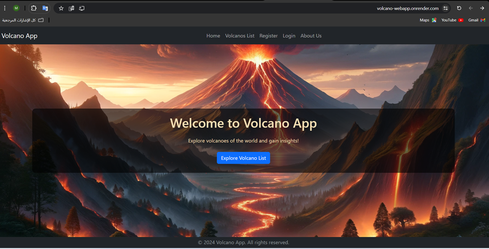
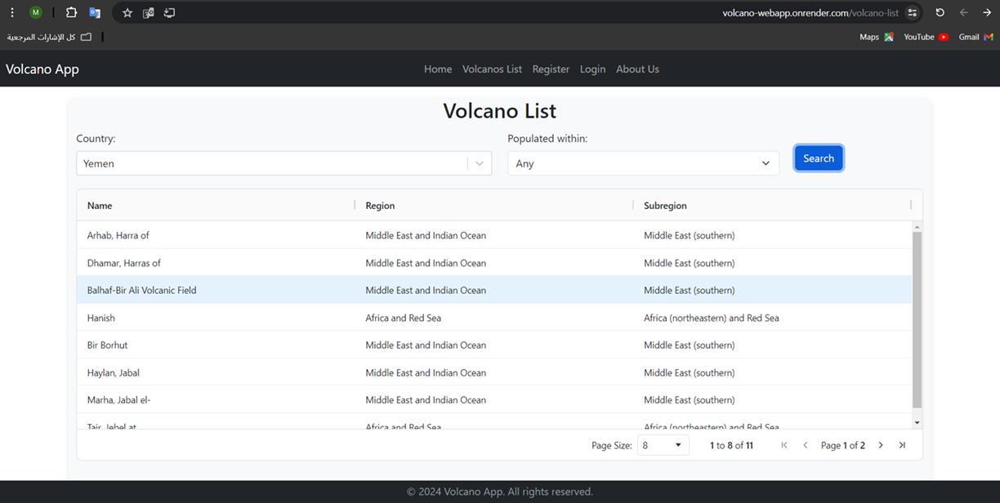
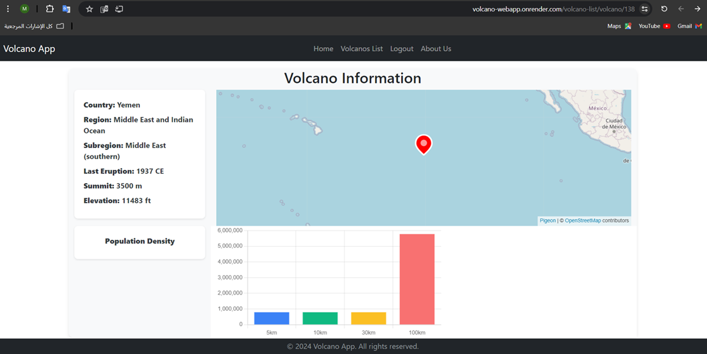
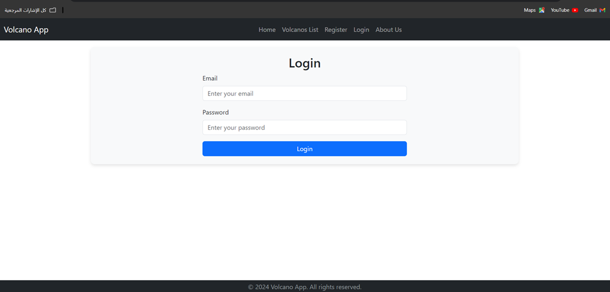
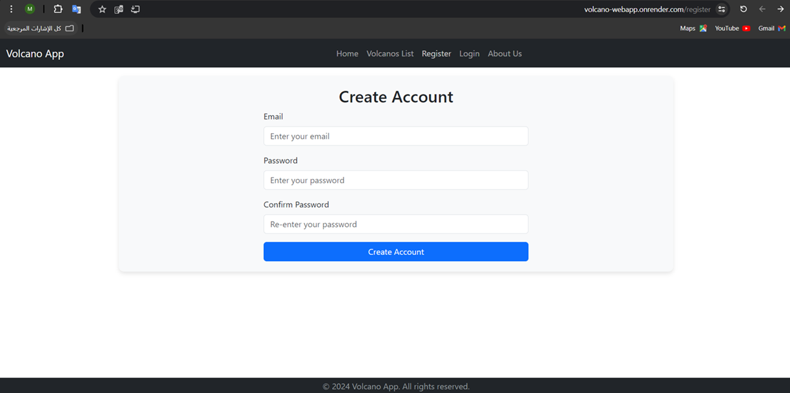
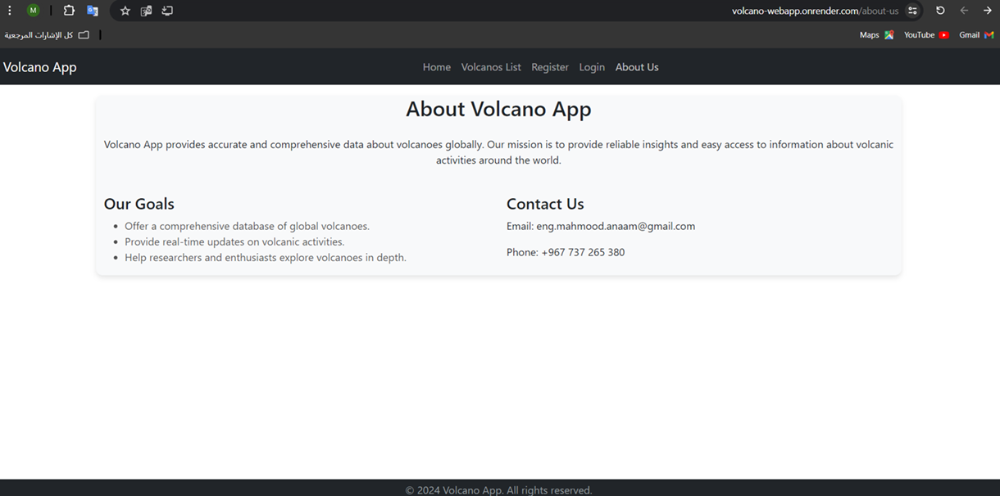

# React Volcano Data Analyzer

This is a React-based web application that allows users to view and analyze data about volcanoes using a custom RESTful API. The application provides a user-friendly interface for exploring volcano data, including detailed information about individual volcanoes and population density visualization.

## Features

- Fetch and display data about volcanoes from a REST API.
- User registration and login to access authenticated data.
- Display a list of volcanoes for a selected country with optional population density filtering.
- Detailed view of individual volcanoes with a map and population density visualization.
- Responsive and user-friendly interface.

## Application Structure

### Home Page

The home page welcomes users with a hero image and navigation options to explore the application.



### Volcano List Page

This page allows users to select a country and optionally filter volcanoes by population density within specified radii. It uses a form for user input and displays results in a table. Users can click on a volcano to view detailed information.



### Individual Volcano Page

Displays detailed information about a selected volcano, including its location on a map (using Pigeon Maps) and population density data (for authenticated users) visualized in a bar chart (using Chart.js).



### Login and Register Pages

These pages provide forms for user registration and login. Upon successful login, users receive a token to access authenticated routes.





### About Us Page

Provides information about the project and its developers.



## Installation

1. Clone the repository:
    ```sh
    git clone https://github.com/Mahmood-Anaam/React-Volcano-Data-Analyzer.git
    ```
2. Navigate to the project directory:
    ```sh
    cd React-Volcano-Data-Analyzer
    ```
3. Install dependencies:
    ```sh
    npm install
    ```
4. Start the development server:
    ```sh
    npm start
    ```

## Usage

1. Open the application in your browser:
    ```
    http://localhost:3000
    ```
2. Navigate through the application using the provided menu to explore volcano data.
3. Register and log in to access additional features such as detailed population density data.

## Deployment

The web application is deployed and accessible at:
[https://react-volcano-data-analyzer.onrender.com](https://react-volcano-data-analyzer.onrender.com)

## Dependencies

This web application relies on a custom RESTful API for data, which can be found in the following GitHub repository:
[NodeJS-Express-Volcanoes-Restful-AP](https://github.com/Mahmood-Anaam/NodeJS-Express-Volcanoes-Restful-API.git)


